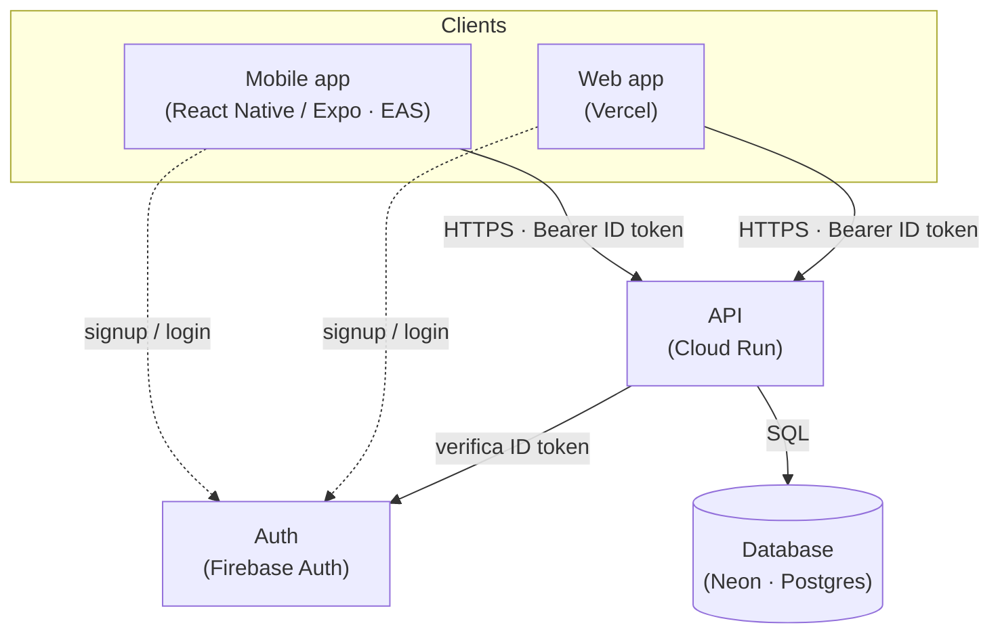

# Visão de arquitetura (C4 — contexto + containers)

> **Documento vivo.** Retrata a topologia **vigente** do produto: quais serviços existem,
> como se conectam e em que provedores rodam. É a foto do "como está hoje", não o histórico
> de decisões — o **porquê** de cada escolha mora nos `ADR`.
>
> **Atualize na mesma edição** que adiciona/remove um serviço ou integração externa. Ao
> criar um `ADR` que mude a topologia, atualize o diagrama abaixo no mesmo PR — se o ADR
> divergir deste documento, **este documento vence** (é o estado vigente; o ADR é o histórico
> do porquê).
>
> Nomes de serviços/sistemas em **inglês** (atravessam para o código); provedores entre
> parênteses. Diagrama em **Mermaid `flowchart`** (renderiza no GitHub de forma confiável,
> nunca uma imagem/PNG como fonte canônica) expressando um C4 nível 1–2.

## Diagrama (container view)

## Containers (legenda)

| Container | Papel | Provedor |
|-----------|-------|----------|
| **Mobile app** | Cliente do `Subscriber`/`PartnerOperator` | React Native / Expo (EAS) |
| **Web app** | Superfície web (ex.: assinatura/landing) | Vercel |
| **API** | Núcleo de domínio; fonte da verdade | Cloud Run |
| **Auth** | Identidade (ID token) | Firebase Auth |
| **Database** | Persistência do domínio | Neon (Postgres) |

> Substitua os containers/provedores acima pela topologia real do seu produto. Mantenha a
> tabela e o diagrama em sincronia — se divergirem, **a tabela vence** (o diagrama ilustra;
> o texto é o canônico).
