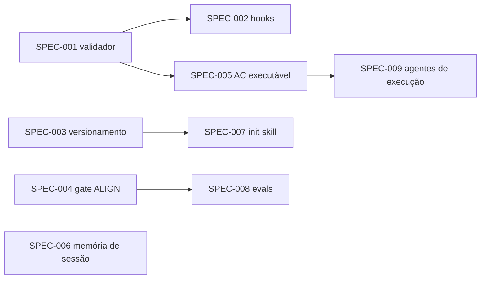

# AYD-002: Melhorias de robustez do framework

> **Meta-AYD (temporário).** O "produto" deste AYD é o próprio scaffold: usamos o framework
> para evoluir o framework. Cada SPEC filha vira **um PR** neste repo. Após a implementação
> completa, este AYD e suas SPECs serão removidos, restando apenas templates/exemplos.
>
> **Onde vivem as SPECs filhas:** `_framework/SPEC-NNN-<slug>.md` na raiz deste repo
> (namespace temporário, fora dos templates, para não se misturar com
> `service-repo/docs/specs/`). `parents: [AYD-002]` em todas.

## Objetivo

Elevar o framework de "convenções em prosa que a IA geralmente obedece" para uma ferramenta
**robusta** (regras críticas viram código determinístico), **completa** (o ciclo fecha do
requisito ao código verificado) e **fácil de adotar** (instalação guiada e atualização sem
cópia manual). Princípio diretor: *regra que importa vira código; prompt é só para o que
exige julgamento.*

## Repos afetados e papéis

O scaffold é um único repo com três componentes; cada SPEC declara quais toca.

| Componente | Papel nesta feature | SPECs que o tocam |
|------------|---------------------|-------------------|
| `context-repo/` (template do repo de contexto) | Recebe validador, hooks, skill cascade evoluída, journal, agentes | SPEC-001, 002, 004, 006, 008, 009 |
| `service-repo/` (template dos repos de serviço) | Recebe validador, hooks, template de SPEC com AC executável, seção de stack | SPEC-001, 002, 005, 009 |
| raiz (README, versionamento, onboarding) | Recebe `.framework-version`, script de update, skill de init, evals | SPEC-003, 007, 008 |

## Contratos (fonte da verdade)

Interfaces entre as peças — quem implementa uma SPEC **não** as redefine; mudança aqui é PR
neste AYD antes de prosseguir.

### C1 — Validator exit contract (SPEC-001, consumido por 002, 005, 008)
```
scripts/validate.(sh|py) [--repo-root PATH]
exit 0  → graph OK
exit 1  → violations found (one line each on stdout)
line:   SEVERITY | RULE_ID | file:line | message
SEVERITY: ERROR | WARN
RULE_IDs: FRONTMATTER_MISSING, PARENT_CHILD_ASYMMETRY, SPEC_WITHOUT_AYD,
          INVALID_STATUS, BROKEN_REF, AC_WITHOUT_TEST (WARN até SPEC-005)
```

### C2 — Hook decision contract (SPEC-002)
```
.claude/hooks/*.sh  (PreToolUse)
stdin:  JSON do evento (tool_name, tool_input, cwd)
exit 0  → allow
exit 2  → block; stderr carries the reason shown to the model
Regras mínimas: SHARED_READONLY (Edit|Write em docs/shared/**),
FROZEN_DOC (Edit em doc com status approved|superseded),
GIT_SAFETY (Bash: push/reset --hard/force exige aprovação humana)
```

### C3 — Version file contract (SPEC-003)
```
.framework-version (raiz do repo instalado)
framework: docs-framework-scaffold
version: <semver da tag instalada>
installed: <yyyy-MM-dd>
files:                        # arquivos DE FRAMEWORK (elegíveis a update/diff)
  - CLAUDE.md
  - .claude/**
  - docs/scripts/sync-context.sh
  - ...
```
Conteúdo de produto (REQ/AYD/SPEC reais) **nunca** entra em `files`.

### C4 — Acceptance-criteria ID contract (SPEC-005, verificado por C1)
```
Na SPEC: cada cenário Gherkin recebe id `AC-N` (comentário na linha do Cenário).
No teste: o nome do teste (ou tag/comentário) referencia `SPEC-NNN/AC-N`.
Regra de lifecycle: SPEC só vira `approved` com todo AC-N mapeado a ≥1 teste.
```

### C5 — Session journal contract (SPEC-006)
```
_meta-session/journal.md   (append-only; budget 200 linhas → auto-arquiva p/ journal-archive/)
entry: ## <yyyy-MM-dd HH:mm> — <1 linha do que foi feito> / pendências / doc IDs tocados
_meta-session/state.md     (sobrescrito; o que está em andamento: AYD/SPEC ativos, status review pendentes)
```

## Decomposição em SPECs (1 SPEC = 1 PR)

Em ordem de prioridade (a mesma do plano aprovado):

| SPEC | Entrega | Depende de |
|------|---------|------------|
| SPEC-001 | **Validador de integridade do grafo** — script determinístico (frontmatter, simetria parents/children, SPEC→AYD, status válidos, refs quebradas), rodável local e em CI | — |
| SPEC-002 | **Guardrails determinísticos** — hooks PreToolUse (C2) + `settings.json` nos dois templates | C1 (reusa checks) |
| SPEC-003 | **Versionamento do framework** — `.framework-version` (C3) + `update-framework.sh` (diff da tag nova só nos arquivos de framework) | — |
| SPEC-004 | **Gate ALIGN na cascade** — passo obrigatório de aprovação humana antes de contrato novo/alterado ou fan-out | — |
| SPEC-005 | **Critérios de aceite executáveis** — template de SPEC com `AC-N` (C4), regra de approval, check no validador | SPEC-001 |
| SPEC-006 | **Memória de sessão leve** — journal + state (C5), importados no CLAUDE.md, escrita ao fim da cascade | — |
| SPEC-007 | **Skill de onboarding `/init-framework`** — entrevista guiada que preenche templates, configura sync, grava `.framework-version`, remove exemplos | SPEC-003 |
| SPEC-008 | **Evals comportamentais** — `evals/` com casos de replay (entrada → comportamento esperado da cascade/agentes), rodados quando skills/agents mudam | SPEC-004 |
| SPEC-009 | **Agentes de execução** — `implementer` (implementa PLAN, lê stack do repo, nunca muda contrato) e `qa-reviewer` (read-only, valida código contra AC-N da SPEC); formaliza a seção de stack do service CLAUDE.md como ponto único | SPEC-005 |

## Fluxo de dependências



SPEC-001, 003, 004 e 006 não têm dependências — podem abrir em paralelo.

## Modelo de domínio afetado

Termos novos usados nas SPECs (em inglês no código/arquivos, conforme convenção):
`validator`, `hook`, `guardrail`, `framework version`, `align gate`, `acceptance criterion (AC)`,
`session journal`, `eval`, `implementer`, `qa-reviewer`. Não entram no glossário do template
(`requirements.md`) porque são termos do **framework**, não do produto-exemplo — o glossário
do scaffold deve permanecer placeholder.

## Decisões relacionadas

- A decisão "regras críticas viram hooks determinísticos, não prosa" merece um **ADR** no
  primeiro PR que a materializa (SPEC-002).
- A separação "arquivos de framework × conteúdo de produto" (C3) merece **ADR** no PR da SPEC-003.

## Fora de escopo / questões em aberto

- **Adapters para Cursor/Copilot** — só se o framework for usado fora do Claude Code; não
  entra neste ciclo.
- **Instalador CLI (npx)** — a opção A (version file + diff) cobre o ciclo atual; CLI é
  evolução futura se houver multi-time.
- Aberto: SPEC-008 (evals) rodará manualmente ou em CI? Decidir no PR da própria SPEC.
