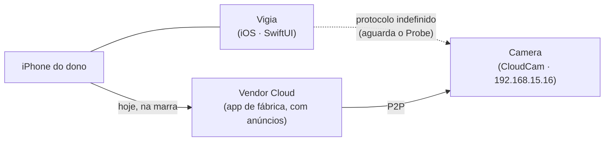
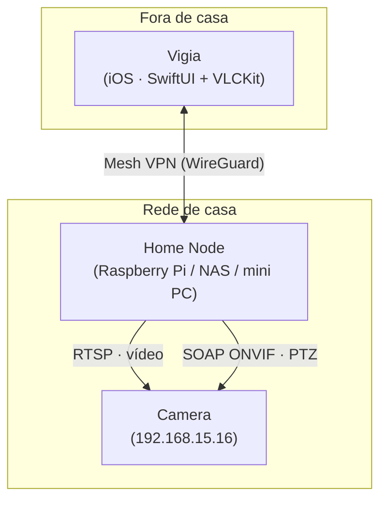
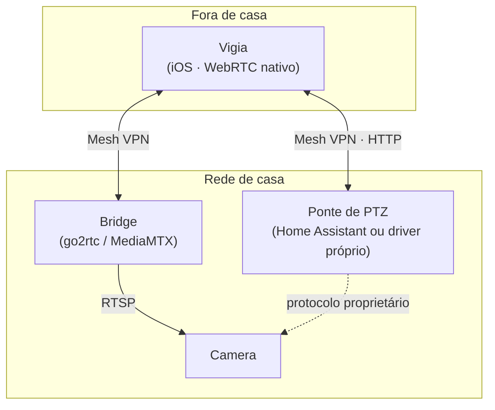
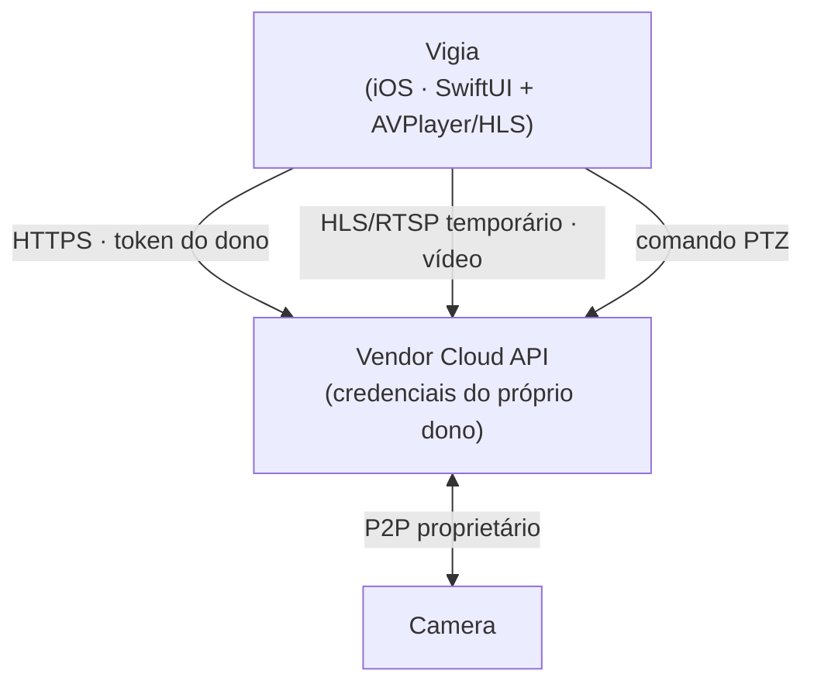

# Visão de arquitetura (C4 — contexto + containers)

> **Documento vivo.** Retrata a topologia **vigente**. O *porquê* de cada escolha mora nos
> `ADR`; aqui fica o *como está*. Se um ADR divergir deste documento, **este documento vence**.
>
> **Estado atual: nada construído.** A topologia final é uma de três, e qual delas vale
> depende do resultado do `Probe` (SPEC-001). As três estão desenhadas abaixo para que a
> decisão, quando vier, seja uma escolha entre opções já pensadas — e não uma descoberta.

## Estado vigente

Hoje o dono usa o app de fábrica, que conversa com a `Vendor Cloud`. O Vigia ainda não
existe; a seta pontilhada é exatamente a incógnita que o `Probe` resolve.

## As três topologias candidatas

Qual delas vira a arquitetura vigente é decidido por AYD-001 / SPEC-001.

### Caminho A — acesso direto (melhor caso)
A `Camera` fala `RTSP` e `ONVIF`. O app conversa com ela diretamente; o acesso remoto é
resolvido por `Mesh VPN`, que faz o iPhone enxergar a rede de casa de qualquer lugar.

Custo: um `Home Node` sempre ligado. Nenhuma porta aberta na internet (RNF-06).

### Caminho B — ponte de mídia
A `Camera` entrega `RTSP` mas não `ONVIF` (ou o `PTZ` é proprietário). Uma `Bridge` no
`Home Node` reempacota o vídeo em WebRTC — latência bem menor e player nativo — e o `PTZ`
precisa de engenharia reversa ou de uma integração pronta (ex.: Home Assistant).

Custo: mais uma peça para manter, mas ganha latência (WebRTC < 500 ms) e some a
dependência de biblioteca de vídeo pesada no app.

### Caminho C — cloud do fabricante
A `Camera` não abre nada na LAN: só fala P2P com a `Vendor Cloud`. O app usa a API
oficial dessa cloud com as credenciais do próprio dono (RN-02) — sem `Home Node`, mas
com dependência de um terceiro que pode mudar ou cobrar.

Custo: nenhum hardware extra e funciona de fora de casa sem esforço — mas o produto passa
a depender de um fornecedor, que é justamente do que se quer fugir. É o caminho de último
recurso; ver AYD-004 para as alternativas antes de aceitá-lo.

## Containers (legenda)

| Container | Papel | Existe em | Tecnologia candidata |
|-----------|-------|-----------|----------------------|
| **Vigia (app iOS)** | Única superfície de uso: exibe o `Stream` e emite `PTZ` | A, B, C | Swift 6 · SwiftUI · iOS 17+ (ADR-001) |
| **Camera** | Origem do vídeo e destino dos comandos `PTZ` | A, B, C | CloudCam, firmware 33.2.0.0920 |
| **Home Node** | Ponto de entrada da rede de casa; hospeda a VPN e a `Bridge` | A, B | Raspberry Pi / NAS / mini PC do dono |
| **Bridge** | Traduz `RTSP` → WebRTC/HLS e centraliza a conexão com a `Camera` | B (opcional em A) | go2rtc ou MediaMTX (ADR-003) |
| **Mesh VPN** | Coloca iPhone e `Home Node` na mesma rede privada, de qualquer lugar | A, B | WireGuard, direto ou via Tailscale (ADR-002) |
| **Vendor Cloud** | Servidor do fabricante; só entra no caminho C | C | indefinido até o `Probe` |

> A tabela é a fonte canônica; os diagramas ilustram. Se divergirem, **a tabela vence**.

## Decisões de arquitetura relacionadas
- **ADR-001** — app nativo iOS (SwiftUI), e não React Native/web.
- **ADR-002** — acesso remoto por `Mesh VPN`, nunca por port forwarding.
- **ADR-003** — stack de vídeo: VLCKit direto vs. `Bridge` WebRTC (pendente do `Probe`).
