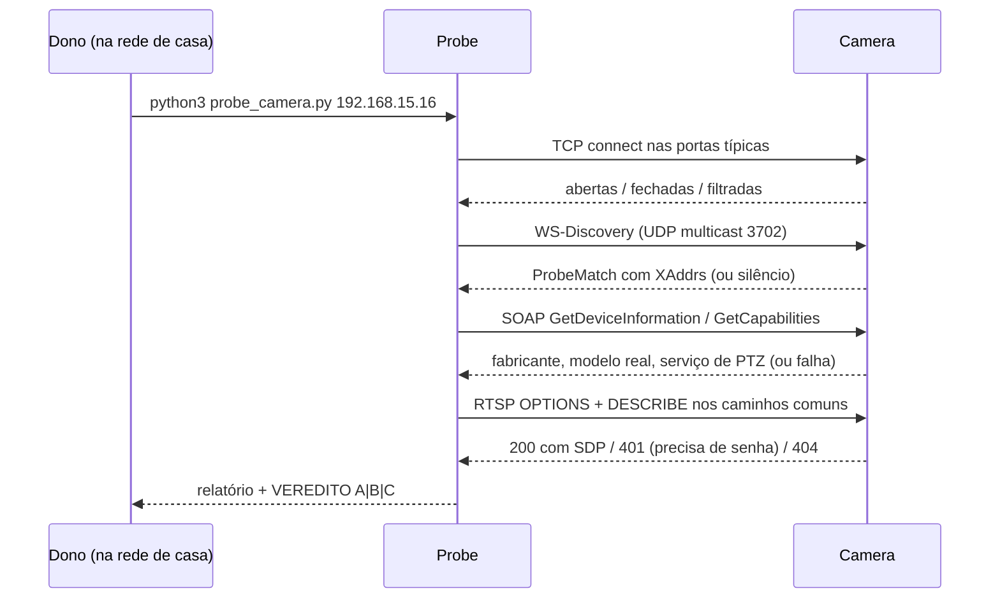

# AYD-001: Descoberta do protocolo da câmera

> **Esta é a feature zero.** Não é código de produto — é o experimento que decide qual
> produto dá para construir. Nenhuma linha de Swift deve ser escrita antes do veredito
> daqui, porque as três topologias candidatas (ver `ARCH`) não compartilham quase nada.

## Objetivo
Determinar empiricamente quais protocolos a `Camera` aceita na rede local, e com isso
escolher entre os caminhos **A**, **B** e **C** da arquitetura. Atende indiretamente
RF-01, RF-02 e RF-03: todos dependem de existir um canal falável com a câmera.

## O que sabemos, e o que isso não prova

| Evidência (lida no app de fábrica) | Leitura honesta |
|------------------------------------|-----------------|
| Modelo: `CloudCam` | **Não identifica o fabricante.** É um rótulo de perfil de firmware white-label; dezenas de OEMs diferentes reportam strings genéricas assim. |
| Firmware `33.2.0.0920` + "Aplicativo integrado" na mesma versão | A ideia de um *app embarcado* versionado junto com o firmware é típica de SDKs de IoT que rodam uma aplicação sobre o firmware base. **Sugere** um SDK de terceiro (família Tuya e similares), não prova. |
| Série `AJWL2405081077M2XHXLDWKCUU023116` | O bloco `2405` provavelmente é a data de fabricação (2024-05). O restante é opaco. |
| MAC `34:A6:EF:90:C6:FB` | O OUI (`34:A6:EF`) identifica o fabricante da placa de rede. **Consultar** em <https://maclookup.app> ou no registro oficial da IEEE — é o dado mais barato e mais informativo que temos. |
| IP `192.168.15.16` | A câmera está na LAN e é endereçável. Isso é o mínimo necessário para o `Probe` funcionar. |

Conclusão: a papelada não decide nada. **Só a rede decide.**

## Componentes afetados e papéis
| Componente | Papel nesta feature | SPEC gerada |
|------------|---------------------|-------------|
| `Probe` (`tools/probe_camera.py`) | Interroga a `Camera` e emite o veredito | SPEC-001 |
| `Camera` | Alvo da interrogação | — |
| Vigia (app iOS) | Não participa — ainda não existe | — |

## Contratos (fonte da verdade)

### Saída do `Probe`
O `Probe` é um contrato tanto quanto uma API: o resto do projeto consome o veredito dele.

```
$ python3 tools/probe_camera.py <ip> [--user USER --password PASS] [--json arquivo.json]

exit 0  -> concluiu (veredito no stdout; caminho A, B ou C)
exit 1  -> host inalcançável ou entrada inválida

stdout: relatório legível, terminando em uma linha
        VEREDITO: CAMINHO <A|B|C> — <justificativa>

--json: mesmo conteúdo como objeto:
        {
          "host": "192.168.15.16",
          "reachable": true,
          "open_ports": [{"port": 554, "service": "rtsp", "banner": "..."}],
          "onvif": {"discovered": bool, "endpoints": [...], "device_info": {...}},
          "rtsp": {"paths_ok": ["/live/ch00_0"], "auth_required": bool, "sdp": {...}},
          "vendor_hints": ["tuya-local-6668", ...],
          "verdict": "A" | "B" | "C",
          "reason": "..."
        }
```

### Sinais e o que cada um significa
| Sinal na rede | Interpretação | Caminho que sugere |
|---------------|---------------|--------------------|
| TCP 554 ou 8554 aberto, `RTSP OPTIONS` responde `200` | Há `Stream` direto | A ou B |
| Resposta a `WS-Discovery` (UDP multicast 239.255.255.250:3702) | Fala `ONVIF` | **A** |
| `GetCapabilities` ONVIF retorna serviço de `PTZ` | `PTZ` padronizado, sem engenharia reversa | **A** |
| RTSP responde mas ONVIF não | Vídeo sim, `PTZ` a descobrir | **B** |
| TCP 6668 aberto e/ou broadcast UDP 6666/6667 | Impressão digital do protocolo local da família Tuya | C (com uma via de API oficial) |
| TCP 34567 aberto | Família XMEye/DVRIP (Xiongmai) — proprietário, mas com protocolo público documentado por terceiros | B ou C |
| TCP 37777 aberto | Protocolo proprietário Dahua | B |
| Nenhuma porta relevante aberta, mas a câmera funciona no app de fábrica | Só P2P de saída para a `Vendor Cloud` | **C** |

## Fluxo



## Modelo de domínio afetado
Nenhuma entidade de produto — o `Probe` só produz conhecimento. O resultado, porém,
define o transporte do `Stream` e o mecanismo de `PTZ` que AYD-002 e AYD-003 vão assumir.

## Decisões relacionadas
- **ADR-003** (stack de vídeo) está travado em `draft` esperando este veredito. Ele não
  pode ser decidido antes, e decidi-lo por palpite seria o erro mais caro do projeto.

## Fora de escopo / questões em aberto
- **Fora:** engenharia reversa profunda de protocolo proprietário (captura de tráfego do
  app de fábrica, análise do binário). Se o veredito for C, isso vira um AYD próprio.
- **Fora:** trocar o firmware da câmera. É uma opção real de último recurso, mas com risco
  de inutilizar o hardware — merece decisão explícita, não um parágrafo aqui.
- **Aberto:** existe um dispositivo sempre ligado na casa para virar `Home Node`? Não
  afeta este AYD, mas afeta a F3 do roadmap e vale confirmar na mesma visita à rede.
- **Aberto:** qual a senha de admin da câmera? Muitos caminhos RTSP só respondem
  autenticados; sem a credencial, o `Probe` distingue "não existe" de "existe e pediu
  senha" (401), mas não vai além disso.
