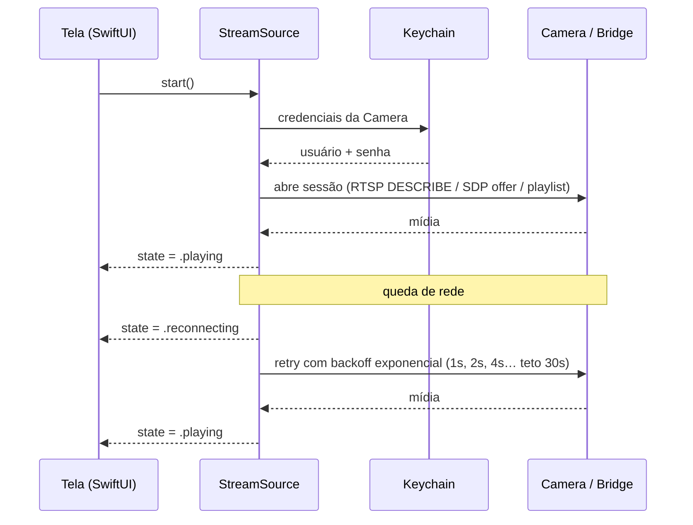

# AYD-002: Streaming ao vivo no app

> Como o `Stream` chega da `Camera` até os pixels do iPhone. Atende RF-01 (vídeo ao vivo),
> RF-05 (resiliência) e os alvos de latência RNF-01/RNF-02.

## Objetivo
Mostrar a imagem ao vivo em tela cheia, rápido, estável, e — o ponto central deste
documento — **de um jeito que não precise ser reescrito quando o veredito do `Probe`
mudar de caminho**.

## A restrição que define tudo
O `AVPlayer` do iOS não fala `RTSP`. Ele fala HLS e MP4 progressivo, e mais nada que sirva
aqui. Isso significa que, nos caminhos A e B, ou o app embarca uma engine de mídia de
terceiro, ou alguém converte o transporte antes de chegar nele.

## A decisão de projeto: isolar o transporte
O protocolo da `Camera` é desconhecido (AYD-001), então o app **não pode** ser construído
em cima de uma suposição sobre ele. A saída é uma costura: a tela conhece um contrato, e
o transporte é uma implementação trocável por trás dele.

```swift
/// Contrato entre a UI e o transporte de vídeo. A tela não sabe — e não deve saber —
/// se por trás disso tem RTSP, WebRTC ou HLS.
protocol StreamSource: AnyObject {
    /// Estados observáveis: .idle, .connecting, .playing, .reconnecting, .failed(Error)
    var state: AsyncStream<StreamState> { get }

    /// Entrega a camada de vídeo que a SwiftUI vai hospedar.
    func makeVideoView() -> UIView

    func start() async
    func stop()
}
```

Implementações previstas, uma por caminho da arquitetura:

| Implementação | Caminho | Transporte |
|---------------|---------|------------|
| `RTSPStreamSource` | A | RTSP direto na `Camera`, via engine embarcada |
| `WebRTCStreamSource` | B | WebRTC servido pela `Bridge` no `Home Node` |
| `HLSStreamSource` | B ou C | HLS em `AVPlayer` — o caminho preguiçoso que sempre funciona, com o custo de latência |

Trocar de caminho passa a ser trocar uma classe, não reescrever o app. Dado que o
veredito ainda não existe, essa é a única postura defensável.

## Opções de engine de vídeo
| Opção | Latência típica | Prós | Contras |
|-------|-----------------|------|---------|
| **VLCKit** (MobileVLCKit) | 1–3 s | Madura, aguenta RTSP/H.264/H.265 e firmware torto; pouquíssimo código no app | Binário grande (dezenas de MB); licença LGPL/GPL — irrelevante para uso pessoal, relevante se um dia for para a loja; controle fino de buffer é limitado |
| **`Bridge` → WebRTC** | < 500 ms | Latência de verdade; player nativo; a `Bridge` já resolve reconexão e múltiplos clientes | Exige o `Home Node` rodando software extra; mais peças para manter |
| **`Bridge` → HLS → `AVPlayer`** | 3–10 s | Zero dependência de terceiro no app; Picture in Picture e AirPlay de graça | Latência alta demais para PTZ confortável — girar a câmera e ver o resultado 6 s depois é uma experiência ruim |
| **FFmpeg + VideoToolbox próprio** | < 1 s | Controle total | Muito trabalho, muita chance de bug sutil de A/V. Não cabe num projeto de hobby. |

A escolha depende do veredito e está formalizada em **ADR-003** (ainda `draft`).

## Detalhes de iOS que costumam morder
Nenhum é difícil; todos são fáceis de esquecer e caros de diagnosticar:

- **Permissão de rede local (iOS 14+):** qualquer conexão para um IP privado dispara o
  alerta de rede local. Exige `NSLocalNetworkUsageDescription` no `Info.plist` com um
  texto honesto — sem isso a conexão simplesmente falha em silêncio.
- **App Transport Security:** RTSP e HTTP em IP privado precisam de `NSAllowsLocalNetworking`
  nas exceções de ATS. Nunca `NSAllowsArbitraryLoads` global.
- **Ciclo de vida:** ao ir para segundo plano, `stop()` — vídeo ao vivo em background
  drena bateria e é derrubado pelo sistema de qualquer jeito. Ao voltar, reconectar.
- **Orientação:** o vídeo precisa acompanhar retrato/paisagem sem recriar a sessão.
- **Sleep:** `isIdleTimerDisabled` enquanto está tocando, senão a tela apaga no meio.

## Fluxo



## Modelo de domínio afetado
- `Camera` — host, porta, credenciais (no Keychain), caminho do `Stream`.
- `StreamState` — `idle` · `connecting` · `playing` · `reconnecting` · `failed`.

## Decisões relacionadas
- **ADR-001** — app nativo SwiftUI (define onde essa camada vive).
- **ADR-003** — qual engine, decidido após AYD-001.

## Fora de escopo / questões em aberto
- **Fora:** gravação, buffer para trás, timeline, múltiplos streams simultâneos.
- **Aberto:** a `Camera` provavelmente expõe dois perfis (alta e baixa resolução). Usar o
  perfil baixo fora de casa economiza dados e latência — decidir quando o `Probe` disser
  se os dois existem.
- **Aberto:** H.265 pode aparecer. VLCKit aguenta; `AVPlayer` via HLS depende do
  empacotamento feito pela `Bridge`.
