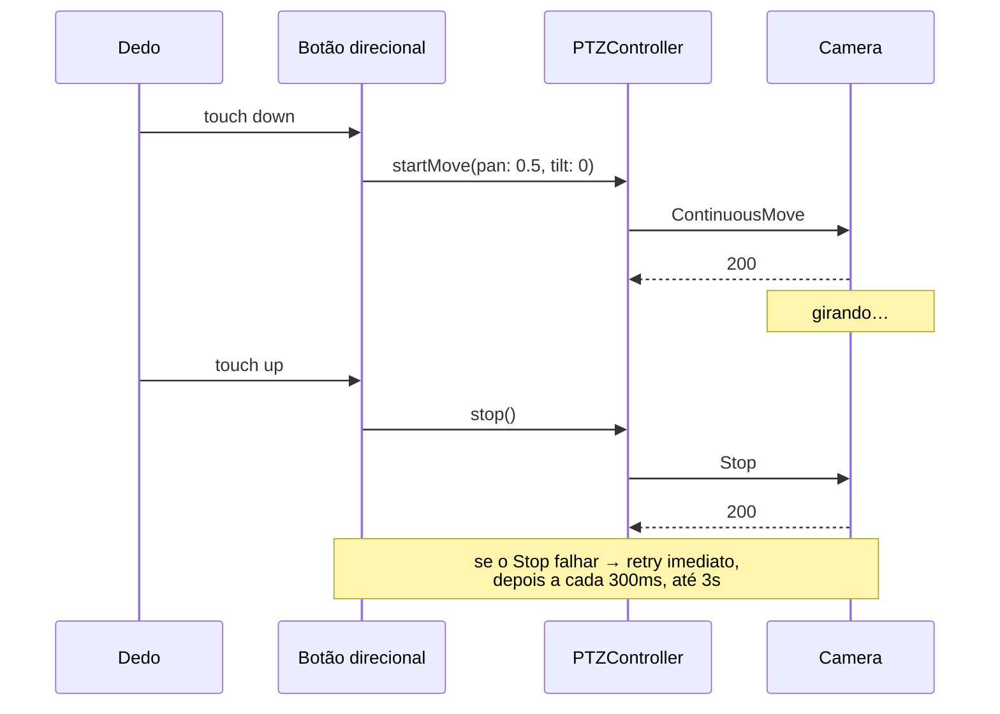

# AYD-003: Controle PTZ (rotação da câmera)

> Como o toque no vidro vira movimento do motor. Atende RF-02 (rotação), RF-06 (`Preset`)
> e o alvo de resposta RNF-03 (< 500 ms).

## Objetivo
Mover a `Camera` em pan e tilt com a sensação de controle direto: gira enquanto o dedo
está lá, para quando o dedo sai. Sem isso, o app não substitui o de fábrica — que é o
único critério que interessa.

## O modelo mental correto: `ContinuousMove` + `Stop`
Existem dois jeitos de mover uma câmera, e escolher o errado estraga a experiência:

- **Passo discreto** ("mova 5° à direita"): cada toque é um pulinho. Alinhar a câmera vira
  uma sequência de toques. É o que os apps ruins fazem.
- **Movimento contínuo**: um comando inicia o giro numa velocidade e a câmera **segue
  girando até receber `Stop`**. É o que corresponde a segurar um botão.

Este produto usa `ContinuousMove` + `Stop`. A consequência importante é de segurança:
**o `Stop` não é opcional.** Se ele se perder — o dedo saiu, mas o pacote não chegou; o
app foi para segundo plano; a rede caiu no meio — a câmera gira até o fim do curso
mecânico. O tratamento disso é requisito, não polimento.

## Componentes afetados e papéis
| Componente | Papel nesta feature | SPEC gerada |
|------------|---------------------|-------------|
| Vigia (app iOS) | Captura o gesto, emite `ContinuousMove`/`Stop`, garante o `Stop` | a definir |
| `Camera` | Executa o movimento | — |
| `Home Node` / `Bridge` | Só no caminho B: traduz o comando para o protocolo proprietário | — |

## Contratos (fonte da verdade)

### Contrato interno do app
Mesma estratégia do AYD-002: a UI fala com um contrato, não com um protocolo.

```swift
protocol PTZController: AnyObject {
    /// pan e tilt em [-1.0, 1.0] — sinal é direção, módulo é velocidade.
    func startMove(pan: Float, tilt: Float) async throws
    func stop() async throws

    var supportsPresets: Bool { get }
    func goToPreset(_ id: String) async throws
    func savePreset(named: String) async throws -> String
}
```

### Caminho A — ONVIF (o caso bom)
`PTZ` vira SOAP sobre HTTP, autenticado com WS-UsernameToken (digest). O envelope é feio,
mas é público, estável e cabe em ~200 linhas de Swift com `URLSession` — não existe
biblioteca ONVIF mantida em Swift, e nem faz falta.

```xml
<!-- POST http://<camera>/onvif/PTZ  ·  Content-Type: application/soap+xml -->
<s:Envelope xmlns:s="http://www.w3.org/2003/05/soap-envelope">
  <s:Header><!-- WS-Security UsernameToken: Username, PasswordDigest, Nonce, Created --></s:Header>
  <s:Body>
    <ContinuousMove xmlns="http://www.onvif.org/ver20/ptz">
      <ProfileToken>Profile_1</ProfileToken>
      <Velocity>
        <PanTilt x="0.5" y="0.0" xmlns="http://www.onvif.org/ver10/schema"/>
      </Velocity>
    </ContinuousMove>
  </s:Body>
</s:Envelope>
```

`Stop` é o mesmo envelope com `<Stop><ProfileToken>…</ProfileToken><PanTilt>true</PanTilt></Stop>`.
O `ProfileToken` vem de `GetProfiles`, chamado uma vez e guardado.

Operações necessárias: `GetProfiles`, `GetConfigurations`, `ContinuousMove`, `Stop`,
`GetPresets`, `GotoPreset`, `SetPreset`.

### Caminhos B e C
Sem ONVIF, o contrato tem que ser descoberto antes de ser escrito. As vias, da mais barata
para a mais cara:
1. **Integração pronta:** se a `Camera` for de família conhecida (Tuya, XMEye), o Home
   Assistant provavelmente já sabe mover ela. Nesse caso a `Bridge` expõe HTTP simples e o
   `PTZController` fica trivial.
2. **API da `Vendor Cloud`:** comandos `PTZ` como chamada autenticada na cloud do
   fabricante, com credenciais do dono (RN-02).
3. **Engenharia reversa:** capturar o tráfego do app de fábrica na LAN e replicar. Vira
   um AYD próprio — é trabalho de verdade, não um detalhe de implementação.

## Fluxo



## Regras de comportamento (não negociáveis)
- **Todo `startMove` tem um `Stop` garantido.** O `Stop` é emitido no touch-up, no
  `onDisappear` da tela, no `scenePhase != .active` e no fim de qualquer erro de rede.
- **`Stop` que falha é retentado** — imediatamente, depois a cada 300 ms por até 3 s.
  Perder um `Stop` é o único bug desta feature capaz de danificar hardware.
- **Watchdog:** nenhum `ContinuousMove` dura mais que 10 s sem renovação. Dedo parado no
  botão além disso, o app reemite; app morto, a câmera para sozinha.
- **Sem fila de comandos:** um comando novo cancela o anterior. Comando de movimento
  enfileirado é movimento fantasma.
- **Feedback imediato:** o botão reage ao toque na hora, antes da resposta da rede. A
  latência percebida é a do vídeo (AYD-002), não a do comando.

## Modelo de domínio afetado
- `PTZCapability` — o que este hardware sabe fazer: pan, tilt, zoom, presets. Descoberto
  uma vez e guardado; a UI esconde o que não existe (em vez de oferecer um botão que falha).
- `Preset` — id, nome. Vive na `Camera`, não no app.

## Decisões relacionadas
- Depende inteiramente do veredito de **AYD-001**.

## Fora de escopo / questões em aberto
- **Fora:** patrulha automática, rastreamento de movimento, zoom digital no app.
- **Aberto:** o hardware tem zoom óptico? Provavelmente não, mas o `Probe` confirma via
  `GetConfigurations` no caminho A.
- **Aberto:** gesto de arrastar sobre o vídeo (mais natural que botões) é desejável, mas
  entra depois — botões primeiro, porque são triviais de acertar e impossíveis de errar.
