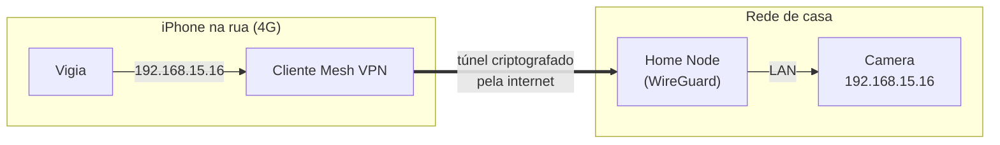

# AYD-004: Acesso remoto (fora da rede de casa)

> Como o app enxerga a `Camera` estando o iPhone em qualquer lugar. Atende RF-03, sob a
> restrição RNF-06 (a câmera não vai para a internet) e RNF-08 (custo recorrente zero).

## Objetivo
Fazer o vídeo e o `PTZ` funcionarem no 4G/5G do dono, longe de casa, **sem** transformar a
câmera num alvo público e **sem** mensalidade.

## O requisito escondido: um `Home Node`
Nos caminhos A e B, o app precisa de um ponto de entrada na rede de casa. Isso não é um
detalhe de infraestrutura, é uma dependência de hardware: **algum dispositivo do dono
precisa ficar ligado 24/7 na LAN.** Serve qualquer coisa modesta:

| Candidato | Custo | Observação |
|-----------|-------|------------|
| NAS, mini PC ou servidorzinho que já exista | R$ 0 | Melhor caso — é só instalar software |
| Mac que fica ligado | R$ 0 | Funciona, mas dorme; exige configurar para não suspender |
| Raspberry Pi Zero 2 W / Pi 4 | ~R$ 200–500, uma vez | Consumo irrisório, é o caminho canônico |
| Roteador com firmware aberto (OpenWrt) | R$ 0 se já tiver | Alguns rodam WireGuard nativo — a opção mais elegante |
| **Nenhum** | — | Bloqueia A e B; força o caminho C |

**Se não houver nenhum candidato, a arquitetura muda de caminho** — vale confirmar isso na
mesma sessão em que o `Probe` for rodado.

## Opções avaliadas

| Opção | Como funciona | Prós | Contras | Veredito |
|-------|---------------|------|---------|----------|
| **`Mesh VPN`** (WireGuard, direto ou via Tailscale) | iPhone e `Home Node` entram na mesma rede privada; o app fala com o IP da câmera como se estivesse em casa | Nada exposto na internet; criptografado ponta a ponta; grátis; **o código do app não muda entre local e remoto** | Exige o `Home Node`; VPN sempre ligada no iPhone | **Escolhida** (ADR-002) |
| **Port forwarding + DDNS** | Abrir 554/80 do roteador para a câmera | Sem hardware extra; sem software extra | Expõe um firmware white-label sem manutenção diretamente à internet. Câmeras assim são alvo padrão de botnet, com senha fraca de fábrica e sem patch. Viola RNF-06. | **Rejeitada** |
| **Túnel reverso** (Cloudflare Tunnel e afins) | O `Home Node` abre a conexão de dentro para fora | Sem porta aberta; funciona em CGNAT | Vídeo da casa passando por um terceiro; mais peças; termos de uso apertados para streaming contínuo | Rejeitada |
| **`Vendor Cloud`** | O app usa a API oficial do fabricante | Sem hardware, sem VPN, funciona de imediato | Devolve ao fabricante o controle do qual o produto quer fugir; sujeito a quota, mudança e desativação | Só no caminho C |

## O que torna a `Mesh VPN` a escolha certa
O ganho não é só de segurança — é de arquitetura. Com a VPN ligada, `192.168.15.16`
(ou um nome estável, se o mesh tiver DNS próprio) resolve igual em casa e no aeroporto.
Isso significa:

- **Zero código de "modo remoto" no app.** Não existe descoberta de rede, troca de
  endereço, NAT traversal ou fallback. A feature RF-03 custa, do lado do app, exatamente
  nada — o que é o melhor tipo de feature num projeto de hobby.
- **Nada a manter em produção.** A VPN é infra do dono, não do app.
- **Um só caminho para testar.** Se funciona em casa, funciona fora.

O custo é honesto e cabe numa frase: o dono precisa deixar a VPN conectada no iPhone.

## Contratos (fonte da verdade)

```
Configuração da Camera guardada no app (Keychain + UserDefaults para o que não é segredo):

  host      string   endereço estável da Camera na rede privada
  port      int      porta do Stream (554 típica)
  username  string   \ ambos no Keychain, nunca em plist ou log (RNF-05)
  password  string   /
  path      string   caminho do Stream, descoberto pelo Probe

O app NÃO distingue local de remoto. Um endereço só, sempre.
```

## Fluxo



## Modelo de domínio afetado
Nenhum acréscimo. É exatamente esse o ponto: o acesso remoto não é uma feature do app,
é uma propriedade da rede.

## Decisões relacionadas
- **ADR-002** — acesso remoto por `Mesh VPN`; port forwarding fica proibido no produto.

## Fora de escopo / questões em aberto
- **Fora:** embarcar VPN no app (via `NEPacketTunnelProvider`). É possível e evitaria
  depender de um app externo, mas é muito trabalho para um ganho de conforto.
- **Aberto:** existe `Home Node` candidato na casa? **Decisão pendente do dono** — é o
  gatilho de risco alto no roadmap (F3).
- **Aberto:** a operadora usa CGNAT? Não afeta soluções mesh com relay, mas afeta
  WireGuard puro apontando para IP de casa. Confirmar antes de escolher a implementação.
- **Aberto:** usar o perfil de baixa resolução quando fora de casa, para poupar dados
  móveis — depende do que o `Probe` achar (ver AYD-002).
